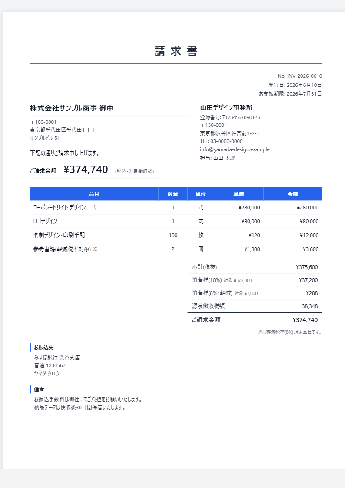

# Invoice Studio

**月額0円・完全オフラインのインボイス制度対応 請求書ジェネレーター(買い切り型)**

ブラウザでHTMLファイルを開くだけで、請求書・見積書・納品書・領収書を作成できます。
インストール不要、アカウント登録不要、データは端末の外に一切出ません。

👉 **[デモを試す(無料)](https://taiman724.github.io/invoice-studio/demo.html)** / **[製品ページ](https://taiman724.github.io/invoice-studio/)**

## 特徴

- **インボイス制度(適格請求書)対応** — 登録番号(T番号)、税率ごとの区分記載(10%/軽減8%/対象外)、軽減税率の※印
- **源泉徴収の自動計算** — 10.21%、100万円超は20.42%の二段階計算
- **完全オフライン** — 全処理が端末内で完結。取引先情報がネットに出ない
- 外税/内税・端数処理(切捨/四捨五入/切上)の切替
- 取引先プリセット保存・JSONバックアップ
- ロゴ・印影画像の埋め込み、ブランドカラー変更
- ブラウザの「印刷 → PDFに保存」でA4にきれいに出力

## 購入($10 / ¥1,500 買い切り)

このリポジトリで公開しているのは**透かし入りのデモ版**です。
透かしのない製品版は [GitHub Sponsors の One-time $10](https://github.com/sponsors/taiman724?frequency=one-time&amount=10) でご購入いただけます(スポンサー後、24時間以内にGitHub経由でお届けします)。BOOTH版は準備中です。

## 免責

本ツールは書類作成の補助を目的としています。税額計算の妥当性(端数処理・源泉徴収の要否・税率区分など)は利用者自身でご確認ください。

---
Built with AI assistance (Claude Code), reviewed and shipped by a human.
